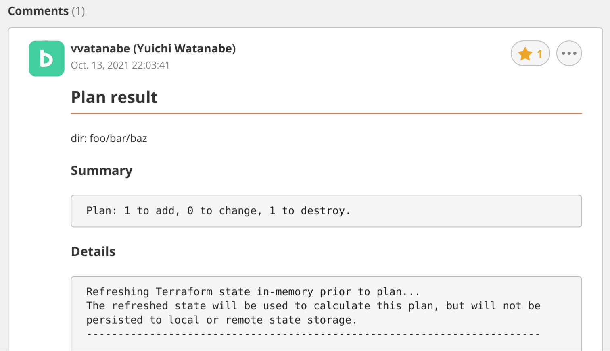

# tf2b

Fork of [mercari/tfnotify](https://github.com/mercari/tfnotify)

tf2b parses Terraform commands' execution result and applies it to an arbitrary template and then notifies it to Backlog comments.

tf2b has enhanced notifications to Backlog. For example, you can choose between Markdown and Backlog text formatting, and the notification information such as base url, project, repository, etc. is automatically read from the repository's .git/config.

<br />

<p align="center">
  
</p>

## Table of contents

* [Table of contents](#table-of-contents)
* [Installation](#installation)
* [What tf2b does](#what-tf2b-does)
* [Usage](#usage)
  * [Basic](#basic)
  * [Command Usage](#command-usage)
* [Configurations](#configurations)
  * [Configurations Examples](#configurations-examples)
  * [Template Vars](#template-vars)
* [Supported CI](#supported-ci)
* [Acknowledgments](#acknowledgments)
* [Bugs and Feedback](#bugs-and-feedback)
* [License](#license)
  * [License of original code](#license-of-original-code)
  * [License of code which we wrote](#license-of-code-which-we-wrote)
* [Author](#author)


## Installation

Supports Go 1.16 or higher.

```
$ go install github.com/vvatanabe/tf2b
```

## What tf2b does

1. Parse the execution result of Terraform
2. Bind parsed results to Go templates
3. Notify it to Backlog pull requests.

Detailed specifications such as templates and notification destinations can be customized from the configuration files.

## Usage

tf2b is just CLI command. So you can run it from your local after grabbing the binary.

### Basic

Basically tf2b waits for the input from Stdin. So tf2b needs to pipe the output of Terraform command like the following:

```
$ export BACKLOG_API_KEY="your api key"
$ terraform plan | tf2b plan
```

For `plan` command, you also need to specify `plan` as the argument of tf2b. In the case of `apply`, you need to do `apply`.

You don't need to set up any notification information (base url, project key, repositopry name). Automatically read from the target repository.

### Command Usage

```console
$ tf2b help
NAME:
   tf2b - Notify terraform results to Backlog

USAGE:
   tf2b [global options] command [command options] [arguments...]

VERSION:
   0.0.0

COMMANDS:
   plan     Run terraform plan and post a comment to Backlog pull request
   apply    Run terraform apply and post a comment to Backlog pull request
   version  Show version
   help, h  Shows a list of commands or help for one command

GLOBAL OPTIONS:
   --ci value        name of CI to run tf2b
   --config value    config path
   --base-url value  base url for the backlog space. eg: foo.backlog.com
   --project value   key of the project to which the repository belongs
   --repo value      repository name
   --pr value        pull request number (default: 0)
   --format value    comment format. eg: markdown or backlog (default: "markdown")
   --help, -h        show help (default: false)
   --version, -v     print the version (default: false)
```

**tf2b plan**

```console
$ tf2b plan help
NAME:
   tf2b plan - Run terraform plan and post a comment to Backlog pull request

USAGE:
   tf2b plan [command options] [arguments...]

OPTIONS:
   --title value    Specify the title to use for notification (default: "Plan result")
   --message value  Specify the message to use for notification
   --help, -h       show help (default: false)
```

**tf2b apply**

```console   
$ tf2b apply help
NAME:
   tf2b apply - Run terraform apply and post a comment to Backlog pull request

USAGE:
   tf2b apply [command options] [arguments...]

OPTIONS:
   --title value    Specify the title to use for notification (default: "Apply result")
   --message value  Specify the message to use for notification
   --help, -h       show help (default: false)
```

## Configurations

When running tf2b, you can specify the configuration path via --config option. If it's omitted, it defaults to

1. tf2b.yaml
2. tf2b.yml
3. .tf2b.yaml
4. .tf2b.yml

### Configurations Examples

The example settings follows. Incidentally, there is no need to replace API key string such as $BACKLOG_API_KEY with the actual API key. Instead, it must be defined as environment variables in CI settings.

```yaml
ci: jenkins
api_key: $BACKLOG_API_KEY
base_url: foo.backlog.com
project: "BAR"
repository: "baz"
pr: 1
terraform:
  plan:
    title: custome title
    message: custome message
    template: |
      {{ .Title }}
      {{ .Message }}
      {{if .Result}}{code}
      {{ .Result }}
      {/code}{{end}}
      {code}
      {{ .Body }}
      {/code}
  apply:
    title: custome title
    message: custome message
    template: |
      {{ .Title }}
      {{ .Message }}
      {{if .Result}}{code}
      {{ .Result }}
      {/code}{{end}}
      {code}
      {{ .Body }}
      {/code}
```

### Template Vars

[template](https://golang.org/pkg/text/template/) of Go can be used for `template`. The templates can be used in `tf2b.yaml` are as follows:

Placeholder | Usage
---|---
`{{ .Title }}` | Like `## Plan result`. A string that can be set from CLI with `--title` option
`{{ .Message }}` | A string that can be set from CLI with `--message` option
`{{ .Result }}` | Matched result by parsing like `Plan: 1 to add` or `No changes`
`{{ .Body }}` | The entire of Terraform execution result
`{{ .Link }}` | The link of the build page on CI

## Supported CI

Currently, supported CI are here:

- Circle CI
- Travis CI
- AWS CodeBuild
- TeamCity
- Drone
- Jenkins
- GitLab CI
- GitHub Actions
- Google Cloud Build

## Acknowledgments

- Forked by [mercari/tfnotify](https://github.com/mercari/tfnotify)
- Inspired by [suzuki-shunsuke/tfcmt](https://github.com/suzuki-shunsuke/tfcmt)

## Bugs and Feedback

For bugs, questions and discussions please use the GitHub Issues.

## License

### License of original code

This is a fork of [mercari/tfnotify](https://github.com/mercari/tfnotify), so about the origincal license, please see https://github.com/mercari/tfnotify#license .

Copyright 2018 Mercari, Inc.

Licensed under the MIT License.

### License of code which we wrote

[MIT License](http://www.opensource.org/licenses/mit-license.php)

## Author

[vvatanabe](https://github.com/vvatanabe)
